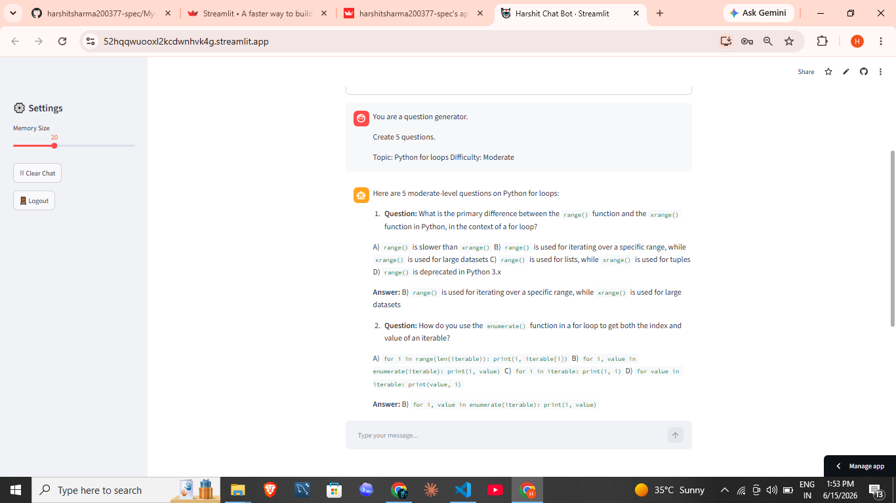
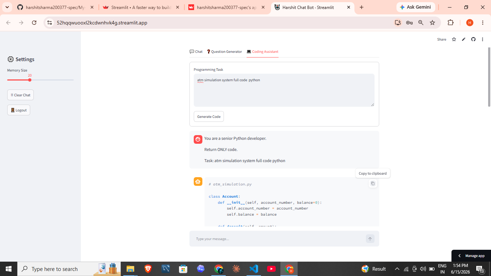

# 🤖 Harshit Chat Bot (Streamlit + Groq AI)

A powerful AI chatbot built using **Streamlit**, **SQLite**, and **Groq API (LLaMA 3)**.  
It includes chat memory, question generator, and coding assistant features with a clean ChatGPT-style UI.

---

## 🔐 Demo Login Credentials

Use the following credentials to access the app:

- **Username:** admin  
- **Password:** 87777  

---

## 🚀 Live Demo

👉 Try the app here:  
https://52hqqwuooxl2kcdwnhvk4g.streamlit.app/

---

## ✨ Features

- 💬 AI Chat with memory (SQLite database)
- ❓ Question Generator (subject + difficulty)
- 💻 Coding Assistant (Python code generator)
- 🔐 Login system using Streamlit secrets
- 🧠 Context-aware AI responses
- ⚡ Fast responses using Groq API (LLaMA 3)
- 📱 Clean ChatGPT-style UI
- 🗑 Clear chat history option

---

## 🛠️ Tech Stack

- Python
- Streamlit
- SQLite3
- Requests
- Groq API (LLaMA 3)

---

## 📸 Screenshots

### 🏠 Chat Interface

### ❓ Question Generator

### 💻 Coding Assistant

---
## 📁 Project Structure

